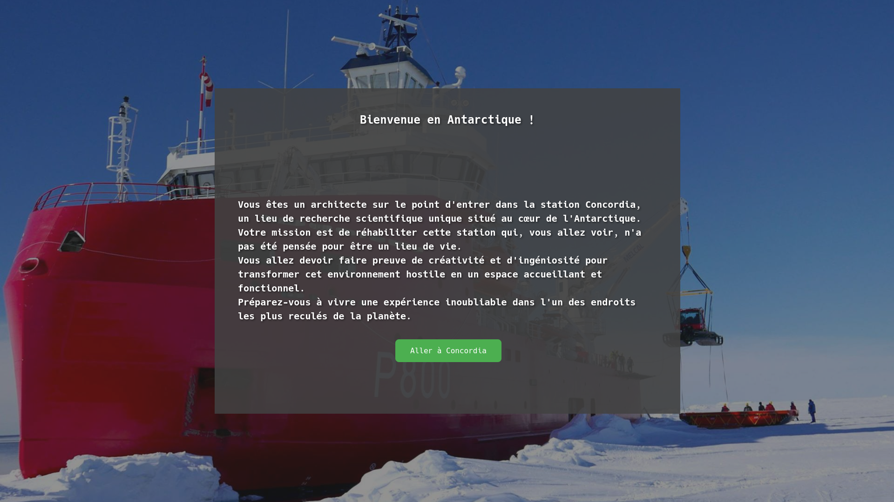
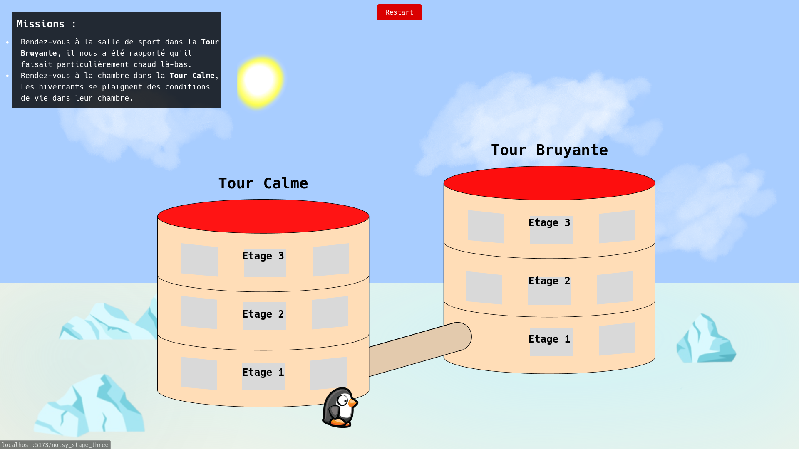
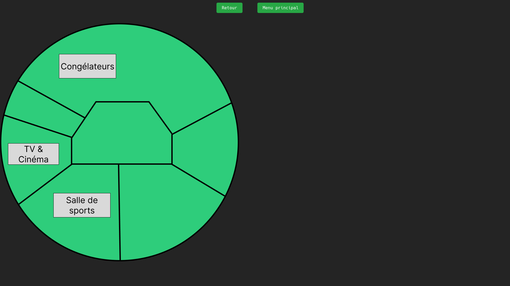
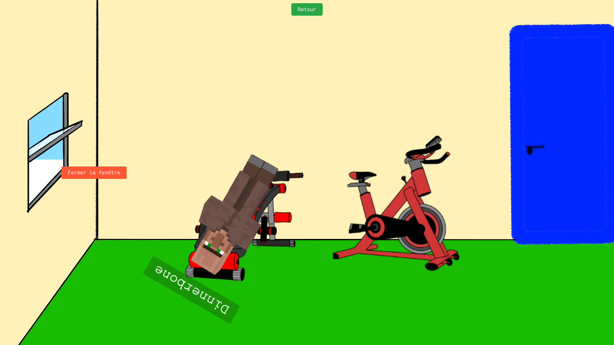
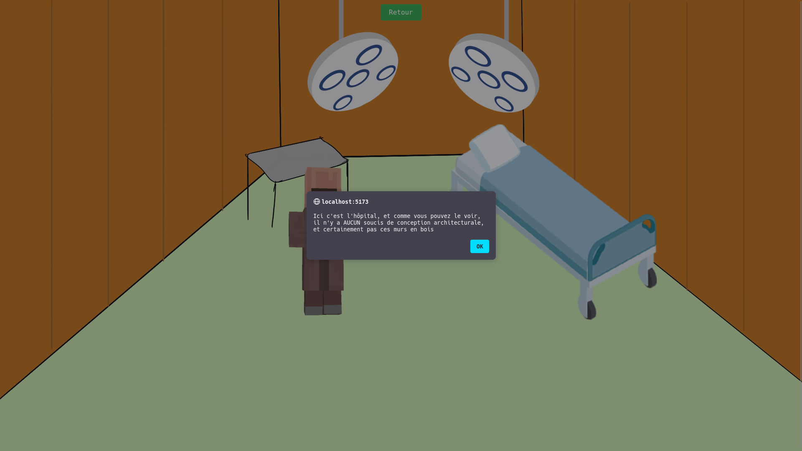
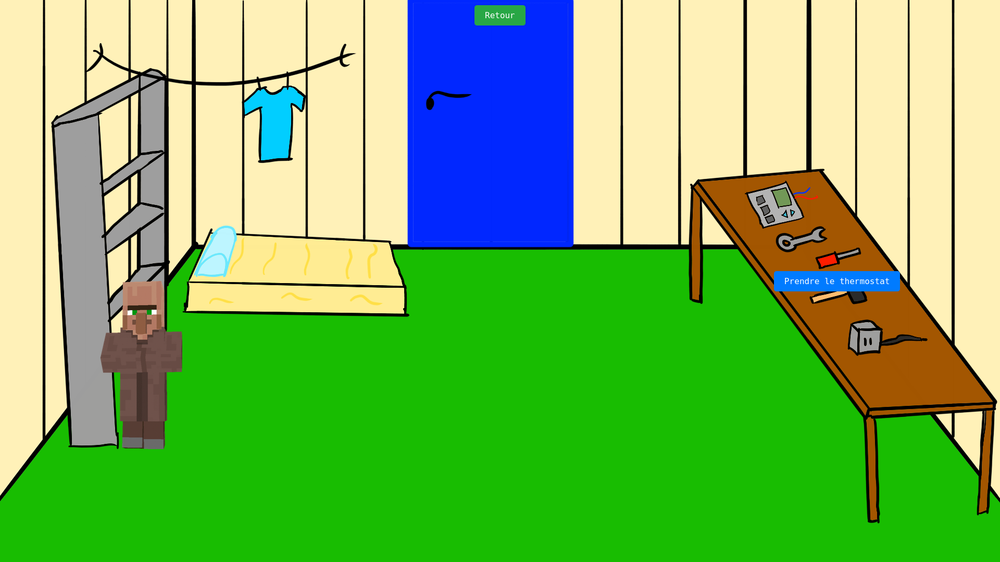

# T4 - Dôme C : Projet Rénovation

- **Nom du groupe** : M3SSM0TEAM-V2  
- **Membres** : Jules Goy, Kilian Sakhi, Maxime Chapuis, Gaëtan Hieber  
- **Liens vers les évaluations T4** :
  - [Bastien Isnard](Evaluations/evaluation-Bastien_Isnard.md)
  - [Elisabeth Maupas](Evaluations/evaluation-Elisabeth_Maupas.md)
  - [Favien Remond](Evaluations/evaluation-Favien_Remond.md)
  - [Halil Bronja](Evaluations/evaluation-Halil_Bronja.md)
  - [Wilson Adjei](Evaluations/evaluation-Wilson_Adjei.md)
  - [Yann Stoll--Geyer](Evaluations/evaluation-Yann_Stoll--Geyer.md)

---

## 🎮 Présentation du projet

Jeu Point and Click dans une base polaire en Antarctique.  
Vous incarnez un architecte envoyé à la station Concordia pour améliorer le confort, la fonctionnalité et la sécurité de la base dans des conditions extrêmes.

---

## 🖼️ Captures d'écran

---

## 🛠️ Installation et exécution

Le jeu est disponible à ce lien : [Dôme C : Projet Rénovation](https://t4-jn87.vercel.app/)

ℹ️ Recommandation : Pour une immersion optimale, il est fortement conseillé de jouer en plein écran.
Vous pouvez activer le mode plein écran en appuyant sur F11 ou en cliquant sur le bouton plein écran de votre navigateur.
Aussi il est recommandé d'avoir un zoom d'écran de 100%.

---

## 📋 Cahier des charges

- [Cahier des Charges](CdC.md)

---

## 🎯 Objectifs pédagogiques

- Comprendre les enjeux de l’architecture dans des environnements extrêmes (climat, isolement, logistique).
- Découvrir les conditions de vie uniques sur la station Concordia.
- Réfléchir aux conséquences humaines de décisions techniques (confort, sécurité, santé mentale...).
- Apprendre à gérer un projet avec des contraintes fortes (temps, ressources, efficacité).

### Objectifs pédagogiques avancés

Approfondir les points précédents à travers des problématiques plus complexes et des scénarios à choix multiples.

---

## 🧩 Fonctionnalités principales

- Carte interactive de la station : navigation entre les différentes zones.
- Interaction avec des éléments problématiques de la station.
- Système d'inventaire : récupération et utilisation d’objets pour résoudre les problèmes.
- Dialogues interactifs avec les membres de la station.

---

## 📌 Missions

Exemples de missions proposées :
- La salle de sport est surchauffée.
- Une idée folle : utiliser de l’urianium !
- Réaménager une chambre pour plus de confort.

---

## 👨‍🔧 Objectifs du joueur

- Améliorer le bien-être des membres de la station.
- Identifier et résoudre les problèmes architecturaux.
- Gérer les ressources de façon efficace.
- Éviter les incidents critiques (blackout, crise sanitaire…).

---

## 🧠 Scénarios

Vous vous baladez dans la station lorsqu’un problème attire votre attention.  
Votre mission : le résoudre. Mais les choses ne sont jamais aussi simples qu’elles en ont l’air…

> Exemple :  
> Vous refermez une fenêtre ouverte dans la salle de sport pour éviter que l’air glacial à -50°C n’entre. Mais rapidement, vous découvrez que cette fenêtre avait été laissée ouverte par les sportifs, car les groupes électrogènes font grimper la température. Comment gérer ce conflit entre sécurité et confort ?

Chaque problème résolu peut entraîner de nouvelles complications, illustrant la complexité de l’architecture en milieu hostile.

---

## 💻 Contraintes de développement

- Implémentation d’une gestion d’inventaire via une classe ou un type contenant une liste d’objets.
- Les objets doivent pouvoir être récupérés et utilisés pour interagir avec les éléments de la station.

---

## 🔬 Fonctionnalités et scénarios avancés

- Intégration des ravitaillements du RAID.
- Ajout du camp d'été.
- Implémentation de shelters spécialisés (physique, sismologie, etc.).
- Prise en compte des contraintes saisonnières (été/hiver antarctique).

---

## 📚 Sources

 - Antarctica Resolution – 2021 – Giulia Foscari Widmann Rezzonico
 - Site de [l'Institu polaire français](https://institut-polaire.fr/fr)